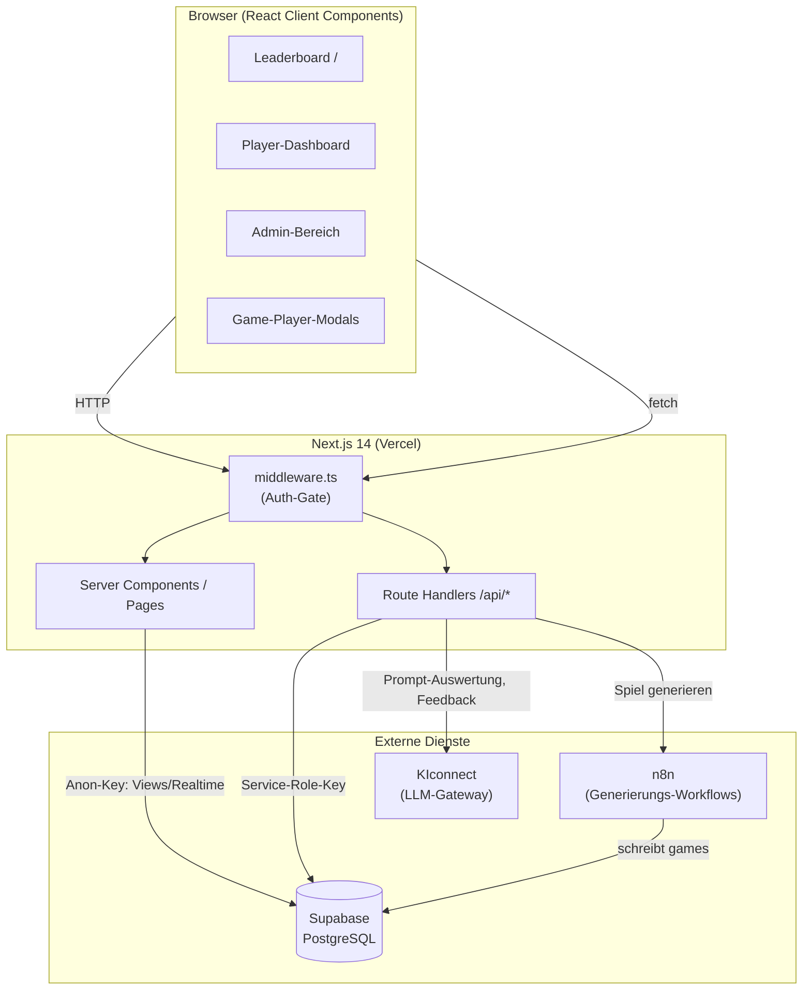
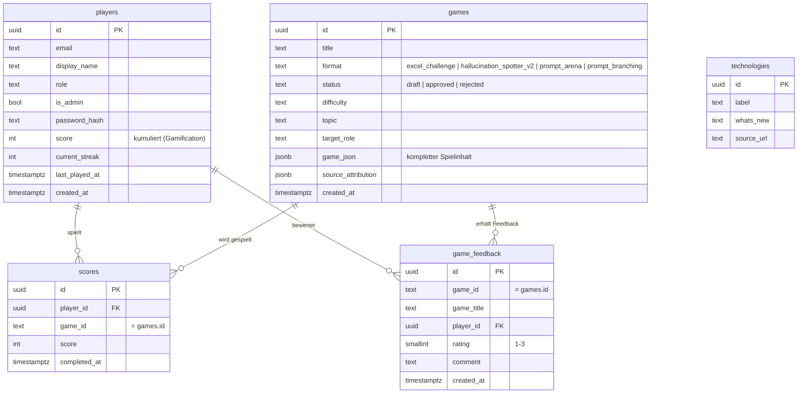
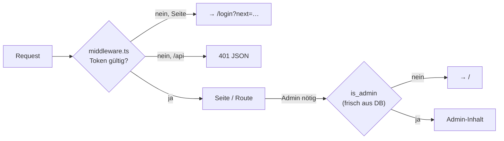
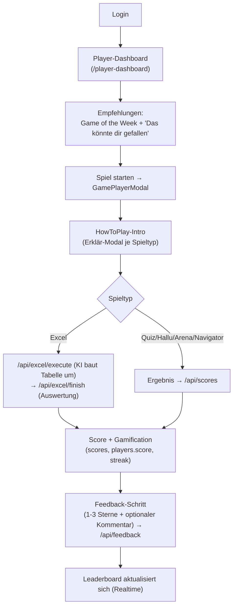
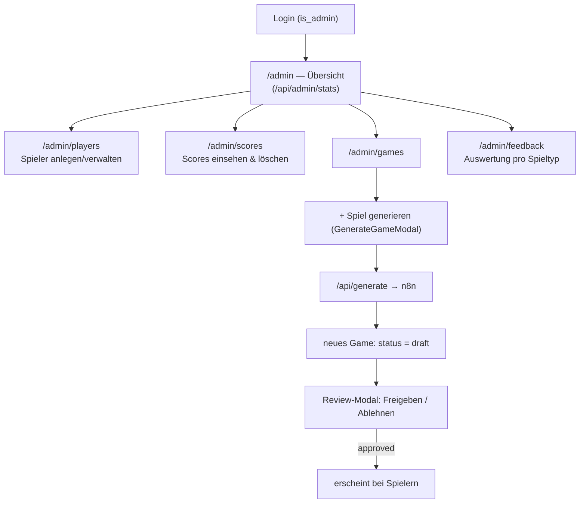
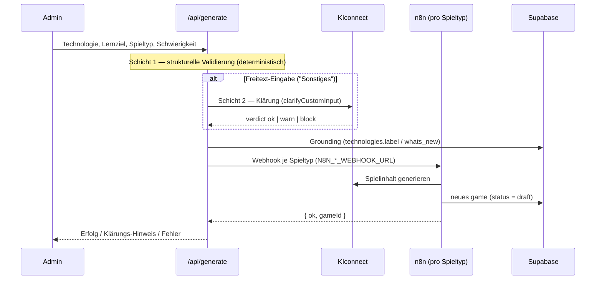

# Architektur & Prozesse — LHG AI Enablement Platform

Gamifizierte Lernplattform, mit der Finance-/Controlling-Mitarbeitende den Umgang mit KI
üben. Spielerinnen und Spieler lösen KI-Challenges (Excel, Prompting, Halluzinations-Erkennung),
sammeln Punkte fürs Leaderboard und geben Feedback. Admins generieren Spiele (KI-gestützt über
n8n), geben sie frei und werten Nutzung & Feedback aus.

> Proof of Concept. Persistenz in Supabase (Postgres), Spielgenerierung ausgelagert an n8n,
> LLM-Aufrufe über das KIconnect-Gateway.

---

## 1. Tech-Stack

| Bereich | Technologie |
|---------|-------------|
| Framework | Next.js 14 (App Router), React 18, TypeScript |
| Styling | Globales CSS mit Design-Tokens (`src/app/globals.css`), komponenten-lokale `<style>`-Blöcke |
| Datenbank | Supabase (PostgreSQL) via `@supabase/supabase-js` |
| Auth | Eigene Session (JWT im HttpOnly-Cookie, `jose`), Passwort-Hashing mit `bcryptjs` |
| LLM | KIconnect-Gateway (`src/lib/kiconnect.ts`) |
| Spielgenerierung | n8n-Webhooks (ein Workflow pro Spieltyp) |
| Icons | `lucide-react` |
| Tests | Vitest (`*.test.ts` in `src/lib`) |
| Hosting | Vercel |

---

## 2. System-Architektur



**Zwei Zugriffswege auf Supabase** (wichtig fürs Verständnis):

- **Client / Server Components mit Anon-Key** (`src/lib/supabase.ts`): nur für öffentlich
  freigegebene Daten — v. a. die `leaderboard`-**View** (inkl. Realtime) und `games`.
- **API-Routen mit Service-Role-Key** (`src/lib/supabase-server.ts`, `supabaseAdmin`): für alles
  Geschützte. Umgeht RLS und ist die einzige Schreib-/Lesequelle für `players`, `scores`,
  `game_feedback` sowie alle Admin-Auswertungen. Reads sind bewusst `cache: 'no-store'`.

---

## 3. Verzeichnisstruktur (Auszug)

```
src/
├─ middleware.ts              # Auth-Gate (Edge): eingeloggt? sonst /login bzw. 401
├─ app/
│  ├─ page.tsx                # Öffentliches Leaderboard (Realtime)
│  ├─ login/                  # Login-Seite
│  ├─ player-dashboard/       # Spieler-Startseite (Stats, Empfehlungen, Spiele)
│  ├─ play/[gameId]/          # Standalone-Spielseite (v. a. Excel)
│  ├─ admin/                  # Admin-Bereich (layout erzwingt is_admin)
│  │  ├─ page.tsx             #   Übersicht (Kennzahlen, letzte Aktivitäten)
│  │  ├─ players/             #   Spielerverwaltung
│  │  ├─ scores/              #   Scores einsehen & löschen
│  │  ├─ games/               #   Spiele generieren / Review / Freigabe
│  │  └─ feedback/            #   Feedback-Auswertung (pro Spieltyp)
│  └─ api/
│     ├─ auth/                # login, logout, me
│     ├─ scores/              # Score beim Spielen speichern
│     ├─ excel/               # execute (KI-Transformation) + finish (Auswertung)
│     ├─ generate/            # Spielgenerierung → n8n
│     ├─ feedback/            # Feedback speichern
│     └─ admin/               # stats, players, scores, feedback (Service-Role, admin-gated)
├─ components/                # Game-Player + Modals (GamePlayerModal, ExcelGamePlayer, …)
├─ lib/                       # supabase(-server), auth, session, gamification, excel*, …
└─ types/game.ts              # Zentrale Typen für Spiele & Spielinhalte
```

---

## 4. Datenmodell



Zusätzlich existiert die **View `leaderboard`** (aggregiert `scores` je Spieler zu
`total_score`, `games_played`, `rank`) — öffentlich über den Anon-Key lesbar und die Quelle des
Realtime-Leaderboards auf `/`.

> `game_feedback` wird per SQL angelegt: [`supabase/game_feedback.sql`](../supabase/game_feedback.sql)
> (einmalig im Supabase SQL-Editor ausführen).

---

## 5. Authentifizierung & Autorisierung

Bewusst **zweistufig** getrennt — Identität vs. Admin-Recht:



- **Identität** — `middleware.ts` prüft bei jedem Request das JWT aus dem Cookie `aiim_session`
  (`src/lib/session.ts`, `jose`, 7 Tage). Kein Token → Seiten leiten auf `/login`, `/api/*`
  antworten mit `401`. Öffentlich sind nur `/login`, die Auth-Routen und `/play/demo`.
- **Admin-Recht** — steht **nicht** im Token (sonst wäre ein Entzug bis zu 7 Tage wirksam),
  sondern wird bei jedem Zugriff frisch aus der DB geprüft: `getSessionAdmin()` in
  [`src/lib/auth.ts`](../src/lib/auth.ts). Das Admin-Layout ([`src/app/admin/layout.tsx`](../src/app/admin/layout.tsx))
  und jede `/api/admin/*`-Route rufen das auf; nicht-Admins werden umgeleitet bzw. mit `403`
  abgewiesen.

---

## 6. User-Prozess (Spieler)



**Ablauf im Detail:**

1. **Login** (`/login` → `/api/auth/login`) setzt das Session-Cookie.
2. **Dashboard** ([`player-dashboard/page.tsx`](../src/app/player-dashboard/page.tsx)) lädt eigene
   Stats & Historie (`/api/auth/me`) und die freigegebenen Spiele (`/api/games`, nur
   `status = approved`). [`recommendations.ts`](../src/lib/recommendations.ts) berechnet ein
   „Game of the Week" und weitere Vorschläge (rollen- & historienbasiert). Deep-Link aus der
   Weekly-Mail möglich: `/player-dashboard?game=<id>`.
3. **Spielen** — [`GamePlayerModal`](../src/components/GamePlayerModal.tsx) erkennt den Spieltyp
   aus `game_json`/`format` und lädt den passenden Player. Jeder Player zeigt zuerst das
   **HowToPlay-Intro** ([`ui/HowToPlay.tsx`](../src/components/ui/HowToPlay.tsx)).
4. **Score speichern:**
   - **Excel**: [`/api/excel/finish`](../src/app/api/excel/finish/route.ts) wertet die Tabelle
     server-seitig aus (`evaluateExcelChallenge`), holt KI-Feedback über KIconnect, schreibt
     `scores` und ruft die Gamification.
   - **Andere Typen**: der Player meldet den Score an [`/api/scores`](../src/app/api/scores/route.ts).
   - Beide leiten die `player_id` **aus dem Session-Token** ab (nicht vom Client).
5. **Gamification** ([`playerGamification.ts`](../src/lib/playerGamification.ts)) schreibt
   `players.score`, `current_streak` und `last_played_at` fort (`computeStreak`).
6. **Feedback** — nach jedem abgeschlossenen Spiel fragt das Modal nach einer Bewertung
   (😕/🙂/😍 = 1–3) und optionalem Kommentar → [`/api/feedback`](../src/app/api/feedback/route.ts).
7. **Leaderboard** (`/`) aktualisiert sich per Supabase-Realtime, sobald neue Scores eintreffen.

---

## 7. Admin-Prozess



- **Übersicht** ([`admin/page.tsx`](../src/app/admin/page.tsx)): Kennzahlen (Spieler, Games
  gespielt, verschiedene Games, Ø-Score) und letzte Aktivitäten — alles server-seitig aggregiert
  über [`/api/admin/stats`](../src/app/api/admin/stats/route.ts) (Service-Role). Game-IDs werden
  dabei zu Spieltiteln aufgelöst.
- **Spieler** ([`admin/players`](../src/app/admin/players/page.tsx)): anlegen, Passwort setzen,
  Admin-Rolle togglen, löschen — über [`/api/admin/players`](../src/app/api/admin/players/route.ts).
- **Scores** ([`admin/scores`](../src/app/admin/scores/page.tsx)): letzte 50 Scores einsehen und
  einzelne (z. B. Test-)Einträge löschen — über `/api/admin/scores`. (Scores entstehen sonst
  automatisch beim Spielen.)
- **Games** ([`admin/games`](../src/app/admin/games/GamesClient.tsx)): Spiele **generieren**
  (siehe §9), nach Status filtern (draft/approved/rejected), **Vorschau** und **Review**
  (Freigeben/Ablehnen setzt `games.status`).
- **Feedback** ([`admin/feedback`](../src/app/admin/feedback/page.tsx)): Übersichtskacheln,
  **Aufschlüsselung pro Spieltyp** (Ø-Bewertung, Verteilungsbalken, Anzahl je Stufe) und die
  Einzel-Feedbacks mit Kommentaren. Der Spieltyp wird in
  [`/api/admin/feedback`](../src/app/api/admin/feedback/route.ts) frisch aus `games` aufgelöst,
  weil `game_feedback` selbst keinen Typ speichert.

---

## 8. Spieltypen

| `format` | Label | Kurzbeschreibung | Player-Komponente |
|----------|-------|------------------|-------------------|
| `excel_challenge` | Excel Challenge | KI-Copilot in simulierter Excel-Oberfläche per Prompt steuern | `ExcelGamePlayer` |
| `hallucination_spotter_v2` | Hallucination Spotter | Besten Prompt wählen, dann Halluzinationen in der KI-Antwort markieren | `HallucinationSpotterPlayerV2` |
| `prompt_arena` | Prompt Arena | Eigenen Prompt schreiben; KI bewertet gegen Referenzlösungen | `PromptArenaPlayer` |
| `prompt_branching` | Prompt-Navigator | Verzweigtes Szenario: Prompt-Optionen wählen und Output bewerten | `BranchingGamePlayer` |
| *(Fragen im `game_json`)* | Quiz | Multiple-Choice-Fragen | `QuizPlayer` (in `GamePlayerModal`) |

Alle Typen laufen einheitlich über `GamePlayerModal` (Dashboard) bzw. `GamePreviewModal`
(Admin-Vorschau). Der komplette Spielinhalt steckt in `games.game_json`; die Typen sind in
[`src/types/game.ts`](../src/types/game.ts) definiert.

---

## 9. Spielgenerierung (Pipeline)



- Ausgelöst über den **GenerateGameModal** ([`GenerateGameModal.tsx`](../src/components/GenerateGameModal.tsx))
  im Games-Tab. Auswahl: Technologie (aus `technologies` oder Freitext), Lernziel, Spieltyp,
  Schwierigkeit — jeweils mit Info-Tooltips.
- [`/api/generate`](../src/app/api/generate/route.ts) validiert in **zwei Schichten**
  (deterministisch + LLM-Klärung bei Freitext), reichert um Grounding-Daten an und ruft den zum
  Spieltyp passenden **n8n-Webhook** (`resolveWebhook`). n8n erzeugt das Spiel und legt es als
  `draft` in `games` ab.
- Generierung ist **asynchron/entkoppelt**: Das neue Spiel erscheint erst nach **Admin-Freigabe**
  (`status = approved`) bei den Spielern.

---

## 10. Score & Gamification

- **`scores`** ist die vollständige Historie (ein Eintrag pro abgeschlossenem Play). Feeds das
  Leaderboard und die Spieler-Historie.
- **`players.score` / `current_streak` / `last_played_at`** sind die fortgeschriebenen
  Gamification-Werte ([`playerGamification.ts`](../src/lib/playerGamification.ts)).
- **Punktevergabe je Spieltyp unterschiedlich:** Bei der Excel-Challenge zählt in die Gamification
  die volle Punktzahl nur bei Bestehen aller Kriterien (die attempt-gewichteten `pointsEarned`
  gehen nur in die `scores`-Historie); bei den anderen Typen die tatsächlich erreichten Punkte.
- Fehler beim Gamification-Update sind **fail-soft**: Das Spielergebnis ist da bereits gespeichert
  und soll nicht kippen.

---

## 11. Wichtige Endpunkte

| Route | Methode | Zweck | Schutz |
|-------|---------|-------|--------|
| `/api/auth/login`,`/logout`,`/me` | POST/GET | Session-Handling | öffentlich / Session |
| `/api/games` | GET | freigegebene Spiele | Session |
| `/api/scores` | POST | Score speichern (Quiz/Hallu/Arena/Navigator) | Session |
| `/api/excel/execute` | POST | KI transformiert die Tabelle | Session |
| `/api/excel/finish` | POST | Excel auswerten + Score + Feedback | Session |
| `/api/feedback` | POST | Spiel-Feedback speichern | Session |
| `/api/generate` | POST | Spielgenerierung anstoßen (→ n8n) | Session |
| `/api/admin/stats` | GET | Übersichts-Kennzahlen | **Admin** |
| `/api/admin/players` | GET/POST/PATCH/DELETE | Spielerverwaltung | **Admin** |
| `/api/admin/scores` | GET/DELETE | Scores einsehen/löschen | **Admin** |
| `/api/admin/feedback` | GET | Feedback inkl. Spieltyp | **Admin** |

---

## 12. Umgebungsvariablen

| Variable | Zweck |
|----------|-------|
| `NEXT_PUBLIC_SUPABASE_URL` | Supabase-Projekt-URL (Client + Server) |
| `NEXT_PUBLIC_SUPABASE_ANON_KEY` | Anon-Key (öffentliche Reads / Realtime) |
| `SUPABASE_SERVICE_ROLE_KEY` | Service-Role-Key (API-Routen, umgeht RLS) |
| `JWT_SECRET` | Signatur der Session-Tokens (Fallback: Service-Role-Key) |
| `N8N_EXCEL_WEBHOOK_URL` | Generierungs-Webhook Excel Challenge |
| `N8N_HALLUCINATION_WEBHOOK_URL` | Generierungs-Webhook Hallucination Spotter |
| `N8N_ARENA_WEBHOOK_URL` | Generierungs-Webhook Prompt Arena |
| `N8N_BRANCHING_WEBHOOK_URL` | Generierungs-Webhook Prompt-Navigator |
| *(KIconnect)* | LLM-Gateway-Zugang, konfiguriert in [`src/lib/kiconnect.ts`](../src/lib/kiconnect.ts) |
```
